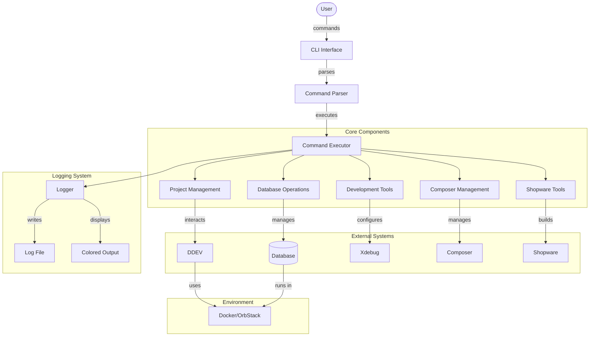

# Development CLI Tools

CLI tool to simplify daily development work with DDEV, Shopware and Symfony.

[](https://github.com/akaw/dev-cli-tools/releases)
[](https://github.com/akaw/dev-cli-tools/actions)
[](https://opensource.org/licenses/MIT)
[](https://www.shellcheck.net/)

> **Note**: The primary language of this project is English. A German translation of the documentation is available in [READMEDE.md](READMEDE.md).

## Architecture



## Installation

The tool consists of a single bash script (`src/dev`) that can be placed anywhere in your system. Here are different ways to install it:

### Option 1: Direct Download

Download just the script file and place it wherever you want, for example in your custom bin directory:

```bash
# Download script (example for ~/config/bin directory)
mkdir -p ~/config/bin
curl -o ~/config/bin/dev https://raw.githubusercontent.com/akaw/dev-cli-tools/main/src/dev
chmod +x ~/config/bin/dev

# Add to PATH if needed (add to .zshrc, .bashrc, etc.)
export PATH="$HOME/config/bin:$PATH"
```

### Option 2: Manual Copy

If you've cloned the repository, you can simply copy the script to your preferred location:

```bash
# Copy script (example for ~/config/bin directory)
mkdir -p ~/config/bin
cp src/dev ~/config/bin/
chmod +x ~/config/bin/dev

# Add to PATH if needed (add to .zshrc, .bashrc, etc.)
export PATH="$HOME/config/bin:$PATH"
```

The script is self-contained and can be placed in any location of your choice. Just make sure the location is in your PATH.

## Requirements

- DDEV
- Docker or OrbStack
- PHP 8.2+
- Node.js 20+

## Main Features

- Project management (start, stop, restart)
- Database operations (import, export)
- Development tools (xdebug, logs, tests)
- Composer management
- Shopware specific commands

### Direct Command Execution
Any command that is not recognized as a shortcut will be executed directly inside the container using `ddev exec`. This allows you to run any command without explicitly using `ddev exec`:

```bash
# These commands are equivalent:
ddev exec php -v
dev php -v

# Run any command in the container
dev node --version
dev composer --version
dev bin/console debug:router
```

## Command Shortcuts

### Project Management
- `dev u` - Start project (up)
- `dev d` - Stop project (down)
- `dev r` - Restart project
- `dev st` - Show status
- `dev o` - Open in browser

### Database
- `dev e` - Export database
- `dev i` - Import database
- `dev sq` - Open Sequel Ace
- `dev mi` - Run migrations

### Development
- `dev x` - Toggle xdebug
- `dev t` - Run tests
- `dev l` - Show logs
- `dev ma` - Mail server

### Composer
- `dev c` - Composer command
- `dev cu` - Update dependencies
- `dev ci` - Install dependencies
- `dev cr` - Add package (require)
- `dev crm` - Remove package
- `dev ca` - Dump autoloader

### Shopware
- `dev b` - Build components
- `dev w` - Watch components
- `dev cc` - Clear cache
- `dev p` - Plugin commands:
  - `dev pr` - Refresh plugins
  - `dev pl` - List plugins
  - `dev pa` - Activate plugin
  - `dev pd` - Deactivate plugin
  - `dev pu` - Update plugin

### Project
- `dev n` - New project
- `dev bk` - Backup
- `dev rs` - Restore

## Examples

```bash
# Start project
dev u

# Import database
dev i

# Install dependencies
dev i

# Build Shopware
dev b s
```

## Development

Contributions are welcome! Please note:

1. Fork the repository
2. Create feature branch
3. Commit changes
4. Create pull request

### Development Setup Tip

```bash
# Install shellcheck (macOS)
brew install shellcheck

# Configure git hooks
git config core.hooksPath .githooks
```

## Testing

The project includes automated tests using [Bats](https://github.com/bats-core/bats-core) (Bash Automated Testing System). See the [tests/README.md](tests/README.md) file for details on running and writing tests.

To run the tests locally:

```bash
# Install Bats (macOS)
brew install bats-core

# Run all tests
bats tests/unit tests/integration
```

## License

This project is licensed under the MIT License.

```text
MIT License

Copyright (c) 2024 Andre Witte

Permission is hereby granted, free of charge, to any person obtaining a copy
of this software and associated documentation files (the "Software"), to deal
in the Software without restriction, including without limitation the rights
to use, copy, modify, merge, publish, distribute, sublicense, and/or sell
copies of the Software, and to permit persons to whom the Software is
furnished to do so, subject to the following conditions:

The above copyright notice and this permission notice shall be included in all
copies or substantial portions of the Software.

THE SOFTWARE IS PROVIDED "AS IS", WITHOUT WARRANTY OF ANY KIND, EXPRESS OR
IMPLIED, INCLUDING BUT NOT LIMITED TO THE WARRANTIES OF MERCHANTABILITY,
FITNESS FOR A PARTICULAR PURPOSE AND NONINFRINGEMENT. IN NO EVENT SHALL THE
AUTHORS OR COPYRIGHT HOLDERS BE LIABLE FOR ANY CLAIM, DAMAGES OR OTHER
LIABILITY, WHETHER IN AN ACTION OF CONTRACT, TORT OR OTHERWISE, ARISING FROM,
OUT OF OR IN CONNECTION WITH THE SOFTWARE OR THE USE OR OTHER DEALINGS IN THE
SOFTWARE.
```

## Author

Andre Witte

## Future Plans

- [x] Test coverage
- [ ] More Symfony specific commands
- [x] Enhanced error handling
- [ ] Project templates

## Git Hooks for Developers

To detect formatting errors and other issues before committing and pushing, you can use Git Hooks:

```bash
# Copy the hooks to your .git directory
cp hooks/pre-commit .git/hooks/
cp hooks/pre-push .git/hooks/
chmod +x .git/hooks/pre-commit .git/hooks/pre-push

# Or set the hooks path directly (easier)
git config core.hooksPath hooks
```

The hooks automatically perform checks:
- **pre-commit**: Version consistency, syntax, executability, formatting (tabs, line length, etc.)
- **pre-push**: ShellCheck and BATS tests (if installed)

Details on the test infrastructure and strategy can be found in [TESTING.md](TESTING.md).
